<div align="center">

```
██████╗ ██╗ ██████╗ █████╗ ██████╗ ██████╗  ██████╗
██╔══██╗██║██╔════╝██╔══██╗██╔══██╗██╔══██╗██╔═══██╗
██████╔╝██║██║     ███████║██████╔╝██║  ██║██║   ██║
██╔══██╗██║██║     ██╔══██║██╔══██╗██║  ██║██║   ██║
██║  ██║██║╚██████╗██║  ██║██║  ██║██████╔╝╚██████╔╝
╚═╝  ╚═╝╚═╝ ╚═════╝╚═╝  ╚═╝╚═╝  ╚═╝╚═════╝  ╚═════╝
```

### Ricardo Augusto de Jesus Costa

**`Full Stack Developer · Paulínia, SP · Brazil`**

[](https://www.linkedin.com/in/ricardo-augusto-344987222/)
[](https://github.com/RicardoAugust-0)
[](https://discord.gg/augutin)
[](mailto:ricardoaugustt0.dev@gmail.com)

</div>

---

## 👨‍💻 Sobre mim

```ts
const ricardo = {
  role:        "Full Stack Developer",
  company:     "MedNet Paulínia",
  location:    "Paulínia, SP — Brasil",
  education:   "Tecnólogo em ADS @ FATEC Paulínia",
  focus:       ["React", "TypeScript", "Node.js", "Supabase", "Azure"],
  building:    "Plataforma de monitoramento de fadiga de motoristas em tempo real",
  interests:   ["Telemetria", "Automação de processos", "PWAs", "Cloud"],
  funFact:     "Apoio a equipe de mídia da minha igreja com tech & multimídia 🎶"
};
```

Desenvolvedor Full Stack com experiência prática em **sistemas de telemetria em tempo real**, automação de processos e desenvolvimento web end-to-end. Domínio do ecossistema **JavaScript moderno** (React, TypeScript, Node.js) e infraestrutura em nuvem com **Microsoft Azure** e Docker.

---

## 🛠️ Stack Técnica

### 🌐 Frontend


### ⚙️ Backend & Infra


### 🗄️ Banco de Dados


### 🤖 IA & Automação


### 🎨 Design & Dados


---

## 💼 Experiência

**🏢 Desenvolvedor de Automação & Analista de Sistemas** — *MedNet Paulínia* `Dez 2025 – Atual`

> Arquitetura e desenvolvimento de plataforma de **monitoramento de fadiga de motoristas em tempo real**, integrando telemetria de múltiplos fornecedores (Maxtrack, Sighra, Sascar). Frontend em **React PWA** + backend com **Supabase Edge Functions**. Automações com **Google Apps Script** para otimização de operações logísticas críticas.

---

**🏢 Assistente de Projetos** — *CRZ Instalações e Montagens* `Jul 2024 – Jun 2025`

> Análise técnica de solicitações, elaboração de projetos conforme normativas internas e suporte pós-venda via Octágora.

---

**🏢 Jovem Aprendiz (Administrativo)** — *Transportes Cavalinho Ltda* `Set 2022 – Abr 2023`

> Auxílio em operações administrativas diárias, desenvolvendo organização e proatividade no ambiente corporativo.

---

## 🚀 Projetos em Destaque

### 🔭 [Sascar Project — Plataforma de Gestão de Telemetria](https://github.com/RicardoAugust-0)
`React` `Supabase` `PWA` `PostgreSQL`

Sistema full stack para centralizar alertas de fadiga veicular. Converteu fluxos de trabalho não-estruturados em dashboards interativos com persistência de dados em tempo real.

---

### 🐾 [Moovox — Telemetria e Geolocalização Animal (TCC)](https://github.com/Moovox/moovox)
`React` `Node.js` `Microsoft Azure` `Vercel`

Plataforma web escalável como alternativa moderna a chips implantados em animais de pequeno porte. Foco em telemetria e rastreamento geográfico acessível.

---

### 📊 [Projeto Nexus — CRM de Prospecção](https://github.com/RicardoAugust-0)
`React` `Vite` `TypeScript` `Supabase` `TailwindCSS`

CRM completo para otimização de processos de prospecção. Inclui sistema de autenticação, banco de dados relacional estruturado e interface componentizada.

---

## 🎓 Formação

| Curso | Instituição | Período |
|---|---|---|
| 🎓 Tecnólogo em Análise e Desenvolvimento de Sistemas | FATEC Paulínia | Cursando |
| 📜 Técnico em Desenvolvimento de Sistemas | ETEC Bento Quirino — Campinas, SP | Jan 2024 – Jul 2025 |
| 📜 Técnico em Caldeiraria | SENAI Ricardo Figueiredo Terra — Paulínia, SP | Jan 2020 – Dez 2021 |

---

## 📋 Certificações

- 🤖 **Imersão Dev com Google Gemini** — Alura *(2024)*
- 🇺🇸 **Proficiency Achievement Certificate — High Intermediate** — Voxy *(2024)*
- 💻 **Lógica de Programação** — SENAC *(2021)*

---

## 📊 Estatísticas GitHub

<div align="center">

<!-- SVGs gerados pelo GitHub Actions (.github/workflows/grs.yml) — sem dependência de APIs externas -->



</div>

---

<div align="center">

**"Cada expert já foi um iniciante. Continue construindo."** 🚀

* By Ricardo Augusto · Paulínia, SP · Brasil*

</div>
