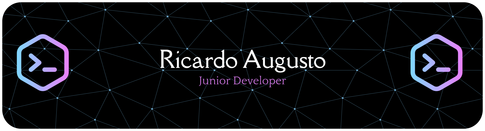

<div align="center">



</div>

---

<div align="center">

### 🌌 Ricardo Augusto — Developer in Progress

*Building the web, one commit at a time.*

[](https://www.linkedin.com/in/ricardo-augusto-344987222/)
[](https://discord.gg/augutin)
[](https://visitcount.itsvg.in)

</div>

---

## 💫 About Me

```js
const ricardo = {
  role:        "Full-Stack Developer (in training)",
  focus:       ["JavaScript", "Node.js", "React", "React Native"],
  currentGoal: "Build meaningful full-stack applications",
  lookingFor:  "Open-source collaborations & beginner-friendly projects",
  learning:    ["JavaScript", "Node.js", "Git/GitHub", "Full-Stack Dev"],
  funFact:     "I support my church's media team with tech & multimedia 🎶"
};
```

---

## 🛠️ Tech Stack

### 🌐 Frontend


### ⚙️ Backend & Infra


### 🗄️ Databases


### 🎨 Design & Data


---

## 📊 GitHub Stats

<div align="center">


</div>

---

## 🏆 Trophies

<div align="center">


</div>

---

## 🔝 Top Contributed Repos

<div align="center">


</div>

---

## ✍️ Dev Quote of the Day

<div align="center">


</div>

---

<div align="center">

*"Every expert was once a beginner. Keep building." 🚀*

</div>

<!-- Crafted with ❤️ by Ricardo Augusto -->
